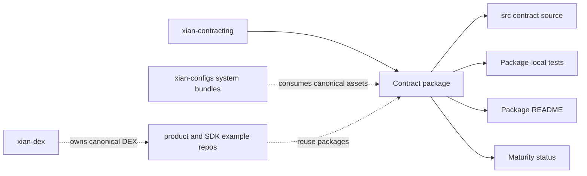

# xian-contracts

`xian-contracts` is the curated contract hub for Xian. It collects reusable
contracts, reference contract systems, and contract standards in one place
with consistent structure, package-level documentation, and a lightweight
validation surface.

This repo curates contract *packages*. Platform-level execution semantics
(metering, storage encoding, runtime helpers) live in
[`xian-contracting`](../xian-contracting). Network-level packaging, system
contract bundles, and templates live in
[`xian-configs`](../xian-configs). Product and example contract sources live in
their owning repos: the canonical DEX contracts live in
[`xian-dex`](../xian-dex), and only DEX-adjacent adapters and examples are
curated here.

## Curation Shape



## Quick Start

```bash
uv sync --group dev
uv run python scripts/validate_contracts.py
uv run pytest
uv run pytest -m slow
```

The default `pytest` path excludes the slow proof-generation tests. Run
`pytest -m slow` explicitly for the heavy shielded-note proving flows.

## Principles

- **Discoverability with structure.** Every contract package has its own
  folder, its own `README.md`, a package-local `contract-bundle.json`, and a
  clear maturity marker.
- **Maturity matters.** Curated, candidate, and experimental contracts are
  labeled honestly — experimental contracts are not presented as
  production-ready.
- **Curation, not platform.** Platform / runtime semantics belong in
  `xian-contracting`. This repo curates contract packages on top of that
  surface.
- **Network packaging is elsewhere.** When a contract becomes part of a
  canonical network, the manifest or source snapshot belongs in `xian-configs`.
  Product and example workflows belong in their owning repos.

## Package Status

| Package                              | Status       | Purpose                                                                                              |
| ------------------------------------ | ------------ | ---------------------------------------------------------------------------------------------------- |
| `contracts/nameservice`              | curated      | Manager-governed name registry with renewal and primary-name mapping                                 |
| `contracts/staking`                  | curated      | Multi-pool staking contract with reward deposits and emergency controls                              |
| `contracts/xsc001`                   | curated      | Token interface checker contract                                                                     |
| `contracts/profile-registry`         | candidate    | Social profile and channel registry scaffold with username resolution                                |
| `contracts/scheduled-actions`        | candidate    | Allowlisted delayed-call scheduler with cancellation and execution controls                          |
| `contracts/shielded-dex-adapter`     | candidate    | Capability-style adapter that lets shielded commands spend a proof-bound public budget through the DEX |
| `contracts/shielded-scheduler-adapter` | candidate  | Proof-bound adapter that lets shielded commands drive scheduled-actions without a caller address |
| `contracts/stream-payments`          | candidate    | Standalone escrowed token-stream contract with upfront funding, claims, shortening, forfeit, and permit relays |
| `contracts/shielded-note-token`      | candidate    | Root / nullifier / note-based shielded token with registry-backed zk verification ids                |
| `contracts/xsc005`                   | candidate    | XSC-0005 NFT standard checker and reference collection (the NFT product surface lives in `xian-nft`) |
| `contracts/reflection-token`         | candidate    | Reflection token designed to integrate with the Xian DEX                                             |
| `contracts/lottery`                  | experimental | Simple lottery pattern using deterministic public randomness                                         |
| `contracts/shielded-commands`        | experimental | Proof-backed shielded command pool for anonymous relayed contract execution                          |
| `contracts/turn-based-games`         | experimental | Generic match registry for turn-based games with off-chain move / state refs                         |
| `contracts/weighted-lottery`         | experimental | Ticket-weighted lottery example with configurable token pricing                                      |

## Key Directories

- `contracts/` — curated contract packages, one package per folder. Each
  package owns its own `README.md`, `contract-bundle.json`, contract source(s),
  and tests.
- `scripts/` — validation and maintenance helpers (e.g.
  `validate_contracts.py`).
- `docs/` — repo-local architecture, backlog, and shielded-stack notes.

## Validation

```bash
uv sync --group dev
uv run python scripts/validate_contracts.py
uv run pytest
uv run pytest -m slow
```

If you change a contract's runtime expectations or add a package, update
the package-level `README.md`, `contract-bundle.json`, and the table above in
the same change.

## Contracting Hub Imports

`xian-contracts` is the source of truth for reusable standalone contract
packages. The contracting hub imports immutable snapshots from package-local
`contract-bundle.json` files instead of treating manual hub entries as
canonical source.

```bash
uv run python scripts/validate_contracts.py

uv run --project ../xian-contracting-hub-web \
  python -m contracting_hub.services.contract_imports \
  ../xian-contracts/contracts/nameservice/contract-bundle.json \
  --package-kind standalone
```

Product-owned systems stay in their product repos. For example, DEX contracts
belong in `xian-dex`; only DEX-adjacent standalone adapters belong here.

## Related Docs

- [AGENTS.md](AGENTS.md) — repo-specific guidance for AI agents and contributors
- [CONTRIBUTING.md](CONTRIBUTING.md) — package contribution rules
- [contracts/README.md](contracts/README.md) — contract package index
- [docs/README.md](docs/README.md) — index of internal docs
- [docs/ARCHITECTURE.md](docs/ARCHITECTURE.md) — major components and dependency direction
- [docs/BACKLOG.md](docs/BACKLOG.md) — open work and follow-ups
- [docs/MANIFESTS.md](docs/MANIFESTS.md) — package manifest standard for hub imports
- [docs/SHIELDED_STACK.md](docs/SHIELDED_STACK.md) — shielded-asset stack and adapter model
