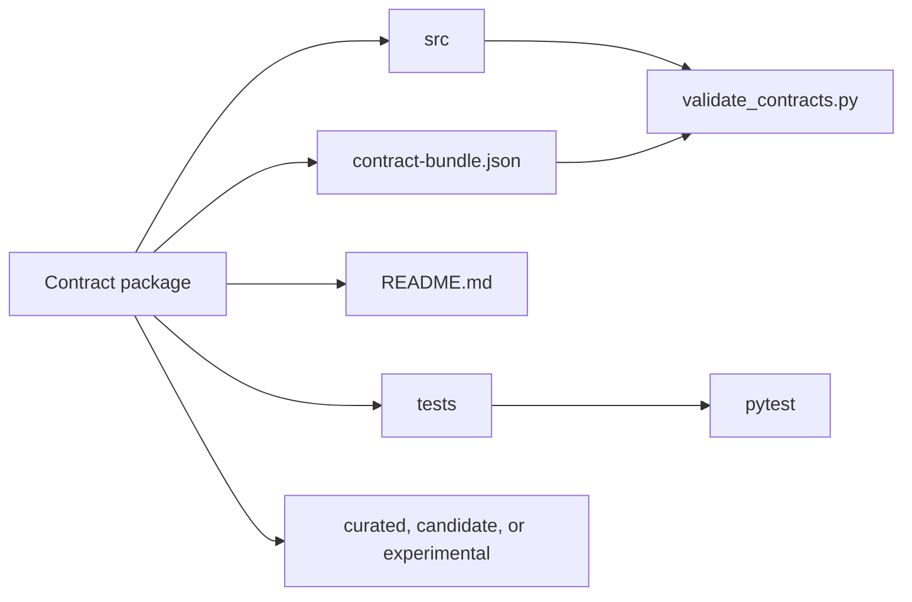

# Contracts

This folder contains the curated contract packages in `xian-contracts`.

## Layout

- one package per standalone contract or tightly coupled contract system
- `src/` for contract source files
- `tests/` for package-local tests or explicit testing notes
- `README.md` in every package as the package entrypoint
- `contract-bundle.json` in every package as the hub import manifest

## Package Status

- `curated`: documented and validated as a strong starting point
- `candidate`: useful and documented, but still needs deeper hardening or
  broader tests
- `experimental`: exploratory or intentionally limited

## Packages

- `lottery/`: simple lottery example
- `nameservice/`: renewable name registry
- `profile-registry/`: social profile and channel registry scaffold
- `scheduled-actions/`: allowlisted delayed-call scheduler
- `shielded-commands/`: proof-backed shielded command pool for relayed execution
- `shielded-dex-adapter/`: capability-style DEX adapter for shielded commands
- `shielded-scheduler-adapter/`: capability-style scheduler adapter for shielded commands
- `shielded-note-token/`: root/nullifier/note-based shielded token contract
- `reflection-token/`: fee-on-transfer reflection token
- `stream-payments/`: standalone escrowed token streaming contract
- `staking/`: multi-pool staking system
- `turn-based-games/`: generic turn-based match registry
- `weighted-lottery/`: ticket-weighted lottery example
- `xsc001/`: token interface checker
- `xsc005/`: non-fungible token interface checker and reference collection

## Package Manifests

Every package manifest uses `xian.contract_bundle.v1`. The manifest lists the
package release version, owner repo, contract names, package-relative source
paths, source hashes, and deterministic deploy order. See
[`../docs/MANIFESTS.md`](../docs/MANIFESTS.md) for the full standard.

## DEX Ownership

- The canonical DEX (`con_pairs`, `con_dex`, `con_dex_helper`, the LP token
  contract, tests, and web frontend) lives in the sibling `xian-dex`
  repository. Cross-contract fixtures should consume the hash-pinned
  `contract-bundle.json` from `xian-dex` unless they are explicitly testing
  unreleased DEX source.
