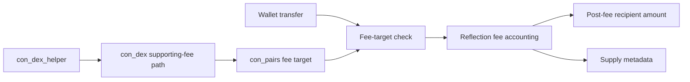

# Reflection Token

Fee-on-transfer reflection token designed to work with the Xian DEX.

## Status

`candidate`

## Contracts

- `src/con_reflection_token.py`: reflection token with reward exclusion and fee
  targets

## Notes

- The contract exposes the canonical XSC001 allowance hash as `approvals`.
- It now passes the package XSC001 interface checker and exposes
  `get_metadata()` for app/tooling reads.
- Fees only apply when either party is marked as a fee target.
- DEX integration requires setting the relevant pair-facing address or addresses
  as fee targets before liquidity is added.
- Excluding pool addresses from rewards is part of the normal setup.
- Excluded balances are tracked explicitly so excluded pools do not distort the
  reflection rate basis.
- The validated end-to-end flow currently uses `con_pairs` as the fee target and
  reward-excluded pool address. Under that model, transfers into the pair are
  taxed too, so adding liquidity with the reflection token side also deposits a
  post-fee amount into the pool.
- Removing liquidity from that same pair also transfers the reflection token out
  of a fee-target address, so the wallet receives the post-fee token amount.
- The current DEX router returns actual credited and received amounts for these
  liquidity flows, which is the behavior the package tests validate.
- Swaps should use the DEX fee-on-transfer path,
  `swapExactTokenForTokenSupportingFeeOnTransferTokens(...)`, for both buys and
  sells.
- The helper contract path is validated too. It now expects an explicit
  absolute deadline and still needs wider slippage than a normal token because
  reflection fees affect the pair-facing leg.
- `operator` and `total_supply` are treated as managed metadata fields. Supply
  metadata stays in sync with fee burns, and metadata authority can be rotated
  with `change_operator(...)`.

## Validation

- repo-wide lint and compile checks
- package-local tests in `tests/test_reflection_token.py` and
  `tests/test_reflection_with_dex.py`
