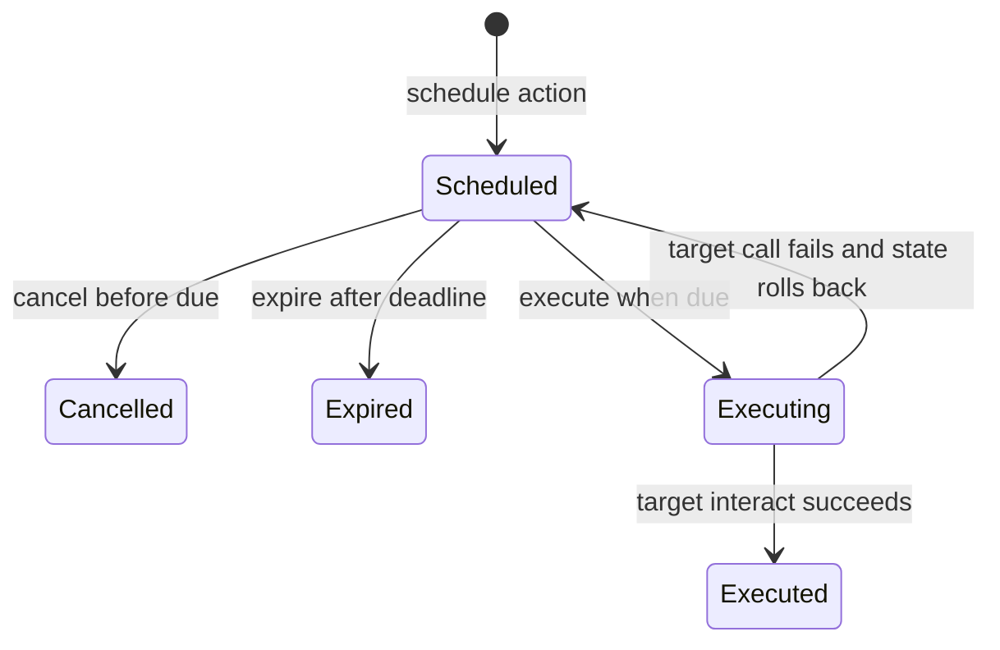

# Scheduled Actions

Allowlisted delayed-call scheduler for contracts that want time-gated execution
without embedding bespoke queue logic.

## Status

`candidate`

## Contracts

- `src/con_scheduled_actions.py`: schedules, cancels, and executes delayed
  contract calls against an allowlisted target set

## Notes

- Execution is still trigger-based. Nothing runs automatically; a caller must
  execute a due action.
- Target contracts must be explicitly allowlisted by the operator.
- Scheduled targets are invoked through a fixed exported
  `interact(payload: dict)` entrypoint instead of arbitrary function dispatch.
- Scheduled actions can be rescheduled, expired explicitly, and are marked
  `executing` before cross-contract calls to avoid simple replay/reentrancy
  races.
- This is intentionally narrower than a cron system. It is a reusable delayed
  execution primitive, not a full automation framework.
- The contract stores payloads on-chain and replays them at execution
  time, so callers should avoid placing secrets in scheduled payloads.

## Validation

- repo-wide lint and compile checks
- package-local automated tests for due execution and expiry handling
