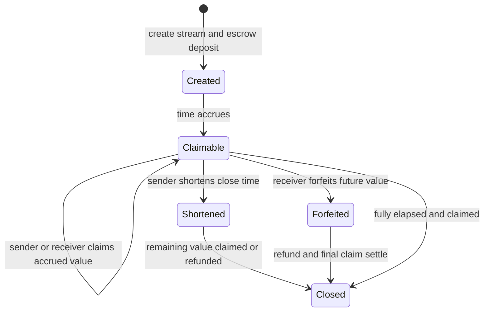

# Stream Payments

Status: `candidate`

This package contains a standalone escrowed token-stream contract for compatible
token contracts. It funds each stream up front, tracks accrued value with
decimal arithmetic, and settles claims from contract escrow.

## Files

- `src/con_stream_payments.py`: standalone stream manager for compatible token
  contracts
- `tests/test_stream_payments.py`: package-local behavior tests

## What It Does

`con_stream_payments` creates time-based payment streams against an external
token contract. Each stream:

- escrows the full stream budget up front
- lets the sender or receiver claim accrued value over time
- allows the sender to shorten a stream and receive the unvested refund
- allows the receiver to forfeit the future part of a stream
- supports signer-authorized `create_stream_from_permit(...)` relays

## Implementation Model

- using `decimal(...)`-backed arithmetic
- making elapsed-time handling explicit and covering it with package-local
  tests
- escrowing the full stream deposit into the contract at creation time
- using a sender nonce in the stream id

## Dependencies

The streamed token contract must expose:

- `transfer(amount, to)`
- `transfer_from(amount, to, main_account)`

The contract validates that interface before using the token.

## Caveats

- `change_close_time(...)` only supports shortening or immediate close. It does
  not support extending a stream in place.
- `create_stream_from_permit(...)` authorizes the stream parameters, but the
  sender must approve `con_stream_payments` on the token
  contract for the escrow transfer to succeed.

## Validation

This package is covered by:

- `uv run python scripts/validate_contracts.py`
- `uv run pytest -q`

The test suite covers escrow funding, accrual, shortening/refunds, forfeit,
multi-day elapsed-time calculation, duplicate schedules via sender nonce, and
permit-based creation.
